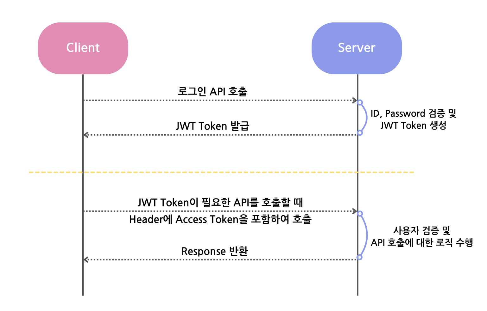

JWT 로그인을 구현하면서 우여곡절이 많았습니다...

이 글에서는 현재까지 제가 이해한 JWT 구현 방법을 설명하고자 합니다!

## JWT 작동 구조


사용자 검증은 총 2단계로 이루어져 있습니다.

1. Access Token 검증

2. ID 및 Password 검증

Access Token에 대한 검증은 JWT Filter에서, ID 및 Password에 대한 처리는 UsernamePasswordAuthenticationFilter 클래스에서 처리됩니다.

Spring Security의 filter에 생성한 JWT Filter를 추가하는 방식으로 Filter를 적용 시킵니다.
<br>

>### [ Spring boot 및 JAVA 버전 ] Spring 3.3.3 & Java 17
<br>

## build.gradle 및 환경 변수 설정
### build.gradle
```yaml
// jwt
implementation group: 'io.jsonwebtoken', name: 'jjwt-api', version: '0.11.5'
runtimeOnly group: 'io.jsonwebtoken', name: 'jjwt-impl', version: '0.11.5'
runtimeOnly group: 'io.jsonwebtoken', name: 'jjwt-jackson', version: '0.11.5'

// Spring Security
implementation 'org.springframework.boot:spring-boot-starter-security'
```
### application.yml
```yaml
jwt:
    secret: ${jwt.secret}
    access:
        expiration: ${jwt.access.expiration}
        header: ${jwt.access.header}
    refresh:
        expiration: ${jwt.refresh.expiration}
        header: ${jwt.refresh.header}
```

### application.properties
```properties
jwt.secret=(대충 긴 암호 코드)
jwt.access.expiration=86400 (24 * 60 * 60 -> 1시간)
jwt.refresh.expiration=1209600000 (24 * 60 * 60 * 1000 * 14 -> 14일)
jwt.access.header=Authorization
jwt.refresh.header=Authorization-refresh
```
암호 코드는 터미널에
```
openssl rand -hex 64
```
을 입력하거나,
https://randomkeygen.com/ 에 접속해서 암호키를 복사/붙여넣기 합니다!
<br>
> .yml 과 .properties 파일 모두 /src/main/resource 폴더 밑에 만들어주면 됩니다. (모르는 사람은 없겠지만..)

<br>

## JWT 로그인 구현하기

JWT 로그인을 구현하는데 필요한 파일입니다.<br>

- JwtToken: Access Token과 Refresh Token을 저장할 DTO 클래스입니다.
- JwtProvider: JWT 기능을 구현할 Service 클래스입니다
- JwtAuthenticationFilter: Spring Security의 filter가 실행되기 전 이 filter 클래스가 실행되어 클라이언트가 보낸 Header로부터 Access Token을 추출하여 사용자를 검증하고 그에 맞는 권한을 부여합니다.
- JwtAuthentication: 사용자 권한 및 정보에 대한 Service 클래스입니다. Authentication 클래스를 상속받습니다.
- JwtAuthEntryPoint: 권한이 없는 사용자가 접근할 시, 예외를 발생시키는 클래스입니다. AuthenticationEntryPoint 클래스를 상속받습니다. (이 때, 403 Forbidden 오류가 발생하게 되고, 이를 커스텀 하기 위해서는 AccessDeniedHandler를 상속받는 클래스에서 Override를 해주면 됩니다. 이 글에서는 다루지 않았습니다.)

### JwtToken.class
```java
@Getter
@Builder
@AllArgsConstructor
public class JwtToken {
    private String accessToken;
    private String refreshToken;
}
```

### JwtProvider.class
```java
@Component
@Slf4j
@RequiredArgsConstructor
public class JwtProvider implements AuthenticationProvider {
    @Value("${jwt.secret}")
    private String secret;
    @Value("${jwt.access.expiration}")
    private long accessTokenValidityInSeconds;
    @Value("${jwt.refresh.expiration}")
    private long refreshTokenValidityInSeconds;
    @Value("${jwt.access.header}")
    private String accessHeader;
    @Value("${jwt.refresh.header}")
    private String refreshHeader;

    private static final String ACCESS_TOKEN_SUBJECT = "AccessToken";
    private static final String REFRESH_TOKEN_SUBJECT = "RefreshToken";
    private static final String USERNAME_CLAIM = "email";
    private static final String BEARER = "bearer ";
    public static final String AUTHORIZATION = "Authorization";

    private final UserRepository userRepository;
    private final ObjectMapper objectMapper;

    public JwtToken issue(User user){
        return JwtToken.builder()
                .accessToken(createAccessToken(user.getId().toString(), user.getUserRole()))
                .refreshToken(createRefreshToken())
                .build();
    }

    public JwtAuthentication getAuthentication(String accessToken) {
        Jws<Claims> claimsJws = validateAccessToken(accessToken);

        Claims body = claimsJws.getBody();
        Long userId = Long.parseLong((String) body.get("userId"));
        UserRole userRole = UserRole.of((String) body.get("userRole"));

        return new JwtAuthentication(userId, userRole);
    }

    @Override
    public String createAccessToken(String userId, UserRole userRole) {
        Claims claims = Jwts.claims();
        claims.put("userId", userId);
        claims.put("userRole", userRole);

        return Jwts.builder()
                .setSubject(ACCESS_TOKEN_SUBJECT)
                .setClaims(claims)
                .setIssuedAt(new Date(System.currentTimeMillis()))
                .setExpiration(new Date(System.currentTimeMillis() + accessTokenValidityInSeconds * 1000))
                .signWith(SignatureAlgorithm.HS256, secret)
                .compact();
    }

    @Override
    public String createRefreshToken() {
        return Jwts
                .builder()
                .setIssuedAt(new Date(System.currentTimeMillis()))
                .setExpiration(new Date(System.currentTimeMillis() + refreshTokenValidityInSeconds * 1000))
                .signWith(SignatureAlgorithm.HS256, secret)
                .compact();
    }

    @Override
    public boolean isTokenValid(String token) {
        try {
            Jwts.parser()
                .setSigningKey(secret)
                .parseClaimsJws(token);
            return true;
        } catch (ExpiredJwtException e) {
            throw new RuntimeException("TOKEN EXPIRED");
        } catch (JwtException e) {
            throw new RuntimeException("TOKEN INVALID");
        }
    }

    public Jws<Claims> validateAccessToken(String token) {
        try {
            return Jwts.parser()
                    .setSigningKey(secret)
                    .parseClaimsJws(token);
        } catch (ExpiredJwtException e) {
            throw new RuntimeException("TOKEN EXPIRED");
        } catch (JwtException e) {
            throw new RuntimeException("TOKEN INVALID");
        }
    }

    public String getAccessTokenFromHeader(HttpServletRequest request) {
        Cookie[] cookies = request.getCookies();
        if (cookies != null) {
            for (Cookie cookie : cookies) {
                if (cookie.getName().equalsIgnoreCase("access-token")) {
                    return cookie.getValue();
                }
            }
        }

        String header = request.getHeader(AUTHORIZATION);
        if (header != null) {
            if (!header.toLowerCase().startsWith(BEARER)) {
                throw new RuntimeException();
            }
            return header.substring(7);
        }

        return null;
    }
}
```
### JwtAuthenticationFilter.class
```java
@Component
@Slf4j
@AllArgsConstructor
public class JwtAuthenticationFilter extends OncePerRequestFilter {
    private final JwtProvider jwtProvider;

    @Override
    protected void doFilterInternal(HttpServletRequest request, HttpServletResponse response, FilterChain filterChain) throws ServletException, IOException {
        ContentCachingRequestWrapper requestWrapper = new ContentCachingRequestWrapper(request);
        ContentCachingResponseWrapper responseWrapper = new ContentCachingResponseWrapper(response);

        String accessToken = jwtProvider.getAccessTokenFromHeader(request);
        if (accessToken != null) {
            Authentication authentication = jwtProvider.getAuthentication(accessToken);
            SecurityContextHolder.getContext().setAuthentication(authentication);
        }

        filterChain.doFilter(requestWrapper, responseWrapper);
        responseWrapper.copyBodyToResponse();
    }
}
```

### JwtAuthentication.class
```java
public class JwtAuthentication implements Authentication {
    @Getter
    private Long userId;
    private UserRole userRole;

    @Override
    public Collection<? extends GrantedAuthority> getAuthorities() {
        Collection<GrantedAuthority> authorities = new ArrayList<>();
        for (String authority : userRole.getName().split(",")) {
            authorities.add(() -> authority);
        }
        return authorities;
    }

    @Override
    public Object getCredentials() {
        return userId;
    }

    @Override
    public Object getDetails() {
        return userId;
    }

    @Override
    public Object getPrincipal() {
        return userId;
    }

    @Override
    public boolean isAuthenticated() {
        return true;
    }

    @Override
    public void setAuthenticated(boolean isAuthenticated) throws IllegalArgumentException {

    }

    @Override
    public String getName() {
        return null;
    }

}
```

### JwtAuthEntryPoint.class
```java
@Component
public class JwtAuthEntryPoint implements AuthenticationEntryPoint {

    @Override
    public void commence(HttpServletRequest request, HttpServletResponse response,
                         AuthenticationException authException) throws IOException, ServletException {
        response.sendError(HttpServletResponse.SC_UNAUTHORIZED, authException.getMessage());
    }
}
```

## Spring Security
JWT에 필요한 모든 클래스를 작성하였으니, 이제 Spring Security에서 JWT를 등록합니다.

### SecurityConfig.class
```java
@Configuration
@EnableWebSecurity
@EnableMethodSecurity(securedEnabled = true)
@RequiredArgsConstructor
public class SecurityConfig {
    private final JwtProvider jwtProvider;

    @Bean // filter 등록
    public JwtAuthenticationFilter jwtAuthenticationFilter() {
        return new JwtAuthenticationFilter(jwtProvider);
    }

    @Bean // 인증이 안 된 사용자 접근 시 Endpoint 예외 발생
    public JwtAuthEntryPoint jwtAuthEntryPoint() {
        return new JwtAuthEntryPoint();
    }

    @Bean // 사용자 비밀번호 암호화
    public PasswordEncoder passwordEncoder() {
        return new BCryptPasswordEncoder();
    }

    @Bean // JWT와는 상관 없지만 front-end에서 back-end로 API 호출 시 발생하는 cors 에러를 해결하는 코드
    CorsConfigurationSource corsConfigurationSource() {
        CorsConfiguration config = new CorsConfiguration();

        config.setAllowCredentials(true);
        config.addAllowedOriginPattern("*");
        config.setAllowedMethods(List.of("GET", "POST", "PUT", "DELETE", "PATCH", "OPTIONS"));
        config.setAllowedHeaders(List.of("*"));

        UrlBasedCorsConfigurationSource source = new UrlBasedCorsConfigurationSource();
        source.registerCorsConfiguration("/**", config);
        return source;
    }

    @Bean
    public SecurityFilterChain filterChain(HttpSecurity http,
                                           HandlerMappingIntrospector introspector) throws Exception {
        return http
                .cors(httpSecurityCorsConfigurer -> corsConfigurationSource()) // cors error 해결
                .csrf(AbstractHttpConfigurer::disable) // url 공격에 취약하기 때문에 비활성화
                .sessionManagement(sessionManagement -> sessionManagement.sessionCreationPolicy(
                        SessionCreationPolicy.STATELESS)) // JWT가 Stateless한 방식으로 작동하기 때문에 비활성화
                .formLogin(AbstractHttpConfigurer::disable) // 따로 form 로그인을 하지 않기 때문에 비활성화
                .httpBasic(AbstractHttpConfigurer::disable) // token을 사용할 것이기 때문에 비활성화
                
                ...

                .addFilterBefore(jwtAuthenticationFilter(), UsernamePasswordAuthenticationFilter.class) // UsernamePasswordAuthenticationFilter 전에 Jwt filter 추가
                .build();
    }
```

<br><br>
여기까지 Spring Security & JWT 로그인 구현 방법에 대해서 작성해 보았습니다. <br>
처음 JWT를 접하고 이에 대한 개념을 이해하기까지 꽤 오랜 시간이 걸렸습니다.. 거의 완벽하게 이해했다고 생각했는데 글을 작성하면서 다시 한 번 개념이 부족했던 부분에 대해서 확실하게 알게 된 것 같아 역시 블로그 글을 작성하길 잘했다고 생각했습니다!
<br><br>
자세한 구현 코드가 궁금하신 분들은
[여기](https://github.com/dku-mgbell/mgbellBE)를 클릭해주세요!<br><br>

>참고 링크

[하나](https://yoo-dev.tistory.com/28), 
[둘](https://velog.io/@limsubin/Spring-Security-JWT-을-구현해보자), 
[셋](https://sjh9708.tistory.com/170)
