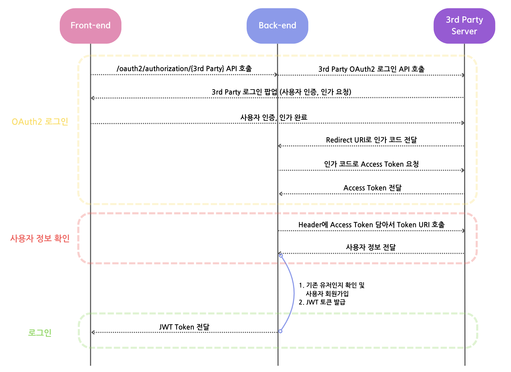
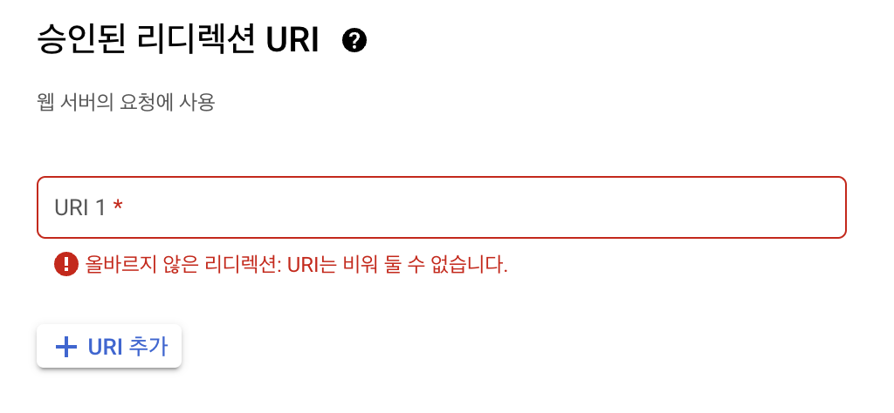
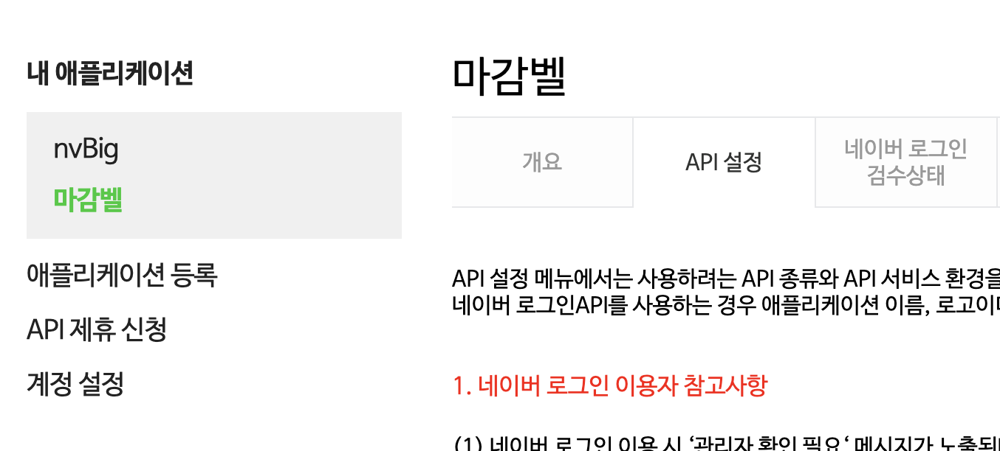
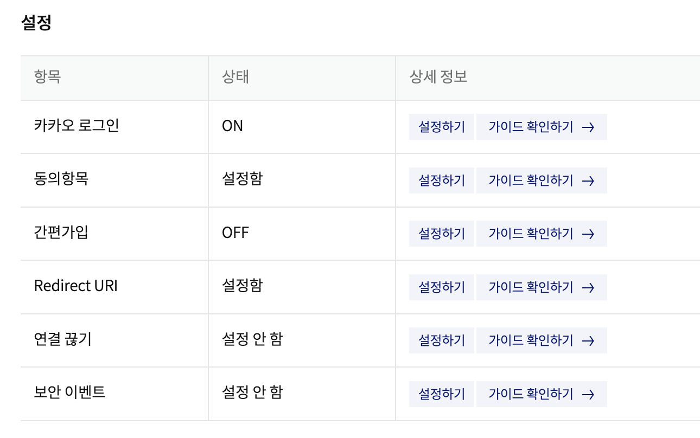
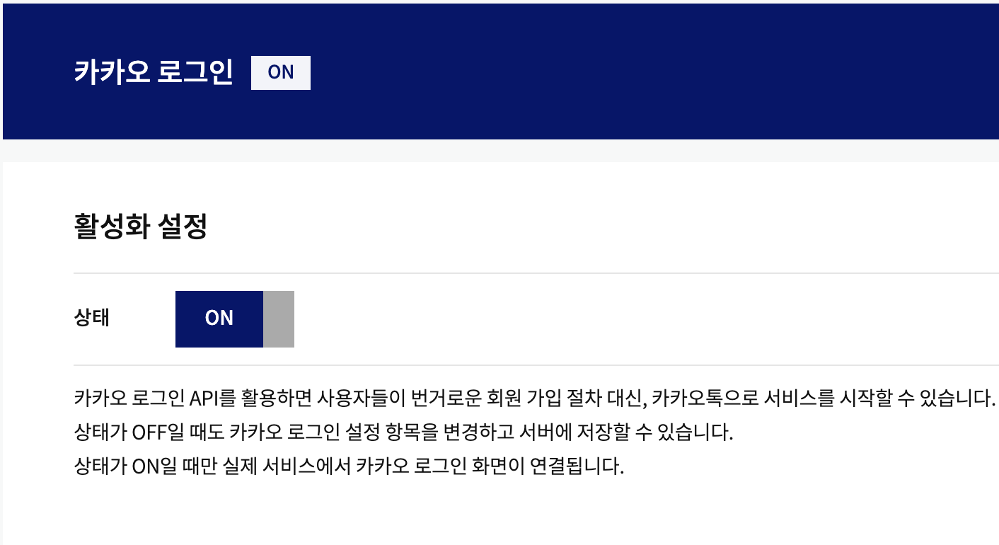

SNS 로그인 기능을 구현하면서 구글, 네이버, 카카오 API 사용법을 모두 적어둔 글이 많지 않아서 구현하는데 꽤 시간이 걸렸습니다..

이번 글에서는 SNS 로그인에 대해서 자세하고 이해하기 쉽게 작성해보고자 합니다!

JWT 로그인에 대한 자세한 글은 [여기](https://sermadl.github.io/posts/Spring-3.0-JWT-%EB%A1%9C%EA%B7%B8%EC%9D%B8-%EA%B5%AC%ED%98%84%ED%95%98%EA%B8%B0-with.Spring-Security/)를 참고해주세요
<br>
<br>
>### [ Spring boot 및 JAVA 버전 ] Spring 3.3.3 & Java 17

## OAuth2 구성
### OAuth2 작동 방식

간단하게 그림으로 나타내보았습니다.

이러한 작동 방식이 원활하게 진행되기 위해

1. OAuth2 앱 등록 후, yml 및 properties에 Redirect URI 및 Token URI 등록하기(구글, 네이버, 카카오 모두 등록해야 합니다.)
2. OAuth2 라이브러리를 사용하여 3rd Party와 통신하기 위한 클래스 구현하기
3. OAuth2 인증, 인가 및 로그인이 성공적으로 끝났을 때 실행되는 클래스(Success Handler) 만들기

와 같은 단계를 진행해야 합니다.<br>
또한, 다음 설명에서 JWT 설정과 관련한 것은 이미 모두 구성되어 있다고 가정하고 이를 제외하고 다룰 것입니다.

## 3rd Party에 OAuth2 앱 등록하기
### Google
> 먼저 [구글 클라우드 콘솔 창](https://console.cloud.google.com/)으로 들어가서 프로젝트 만들기 및 OAuth2 동의 화면 생성 과정이 모두 끝났다는 가정 하에 설명을 진행합니다.

사용자 인증 정보 > 사용자 인증 정보 만들기 > OAuth 클라이언트 ID > 애플리케이션 유형 선택(저는 '웹 애플리케이션'을 선택했습니다.)



승인된 리디렉션 URI 설정이 가장 중요합니다.
properties에서 설정할 리디렉션 URI를 작성하면 됩니다.
같은 URI를 작성해야 한다는 것을 꼭 잊지 마세요!!
> 저는 테스트 용 localhost url과 배포된 ec2 url을 모두 작성했습니다.
ec2 url을 작성한 경우, 승인된 JavaScript 원본 밑에 ec2 url을 포트번호 없이 ec2-12-123-123-123.~~.compute.amazonaws.com까지 작성해야 합니다.

오른쪽에 있는 클라이언트 ID와 Secret은 이따 Properties에 등록할 것이기 때문에 창을 닫지 말고 따라와주세요!

## Naver
> 먼저 [네이버 애플리케이션 등록 페이지](https://developers.naver.com/apps/#/register?api=nvlogin)에서 애플리케이션 등록이 끝났다는 가정 하에 설명을 진행합니다.

내 애플리케이션 > {내 앱} > API 설정 > 로그인 오픈 API
서비스 환경 > 환경 추가(저는 PC 웹을 선택했습니다)


저는 서비스 URL에 추후에 연결할 도메인을 작성했습니다.

네이버 로그인 Callback URL이 가장 중요합니다.
properties에서 설정할 리디렉션 URI를 작성해야 합니다!

'개요' 탭에 있는 클라이언트 ID와 Secret은 이따 Properties에 등록할 것이기 때문에 창을 닫지 말고 따라와주세요!

## Kakao
> 먼저 [카카오 개발자 페이지](https://developers.kakao.com/console/app)에서 애플리케이션 등록이 끝났다는 가정 하에 설명을 진행합니다.

내 애플리케이션 > 앱 설정 > 대시보드 > 설정



'카카오 로그인' 설정하기 탭으로 들어갑니다!<br><br>


활성화 시켜 준 뒤,<br>
Redirect URI 설정이 가장 중요합니다.
properties에서 설정할 리디렉션 URI를 작성하면 됩니다.
같은 URI를 작성해야 한다는 것을 꼭 잊지 마세요!!

왼쪽 '앱 키' 에서 'REST API 키'는 이따 Properties에 등록할 것이기 때문에 창을 닫지 말고 따라와주세요!

## build.gradle 및 환경 변수 설정
### build.gradle
```yml
// jwt
implementation group: 'io.jsonwebtoken', name: 'jjwt-api', version: '0.11.5'
runtimeOnly group: 'io.jsonwebtoken', name: 'jjwt-impl', version: '0.11.5'
runtimeOnly group: 'io.jsonwebtoken', name: 'jjwt-jackson', version: '0.11.5'

// Spring Security
implementation 'org.springframework.boot:spring-boot-starter-security'

// Spring Web
implementation 'org.springframework.boot:spring-boot-starter-web'
```

### application.yml
```yml
jwt:
  secret: ${jwt.secret}
  access:
    expiration: ${jwt.access.expiration}
    header: ${jwt.access.header}
  refresh:
    expiration: ${jwt.refresh.expiration}
    header: ${jwt.refresh.header}

oauth:
  uri: ${oauth.uri}
```

### application.properties
```properties
spring.profiles.include=oauth(application-oauth.properties를 포함시켜주는 코드)
jwt.secret=(암호 코드)
jwt.access.expiration=86400
jwt.refresh.expiration=1209600000
jwt.access.header=Authorization
jwt.refresh.header=Authorization-refresh
oauth.uri=http://localhost:3000/sign-up
```

여기서 설정한 oauth.uri는 OAuth2 로그인 이후 JWT Access Token이 전달될 URI입니다.<br>
저의 경우, 프론트와 액세스 토큰을 주고 받기 위해 uri를 localhost:3000으로 설정해두었지만, 로컬에서 테스트 하는 분들은 localhost:8080/~ 로 설정하시면 됩니다. 

(이 부분과 /oauth2/authorization/{3rd party}
(Ex: http://localhost:8080/oauth2/authorization/google)로 접속하면 바로 oauth2 로그인이 된다는 것을 설명해 둔 블로그 글이 없어 프론트와 연결할 때 정말 많은 시간을 보내야 했습니다......부디 이 글을 보신 분들은 시간을 허비하는 일이 없기를..!!)

### application-oauth.properties
```properties
    #google
    spring.security.oauth2.client.registration.google.client-name=google
    spring.security.oauth2.client.registration.google.client-id=(구글 클라이언트 ID)
    spring.security.oauth2.client.registration.google.client-secret=(구글 클라이언트 secret)
    spring.security.oauth2.client.registration.google.redirect-uri=http://(ec2 url):8080/login/oauth2/code/google
    spring.security.oauth2.client.registration.google.authorization-grant-type=authorization_code
    spring.security.oauth2.client.registration.google.scope=profile,email

    #naver
    spring.security.oauth2.client.registration.naver.client-name=naver
    spring.security.oauth2.client.registration.naver.client-id=(네이버 클라이언트 ID)
    spring.security.oauth2.client.registration.naver.client-secret=(네이버 클라이언트 secret)
    spring.security.oauth2.client.registration.naver.redirect-uri=http://(ec2 url):8080/login/oauth2/code/naver
    spring.security.oauth2.client.registration.naver.authorization-grant-type=authorization_code
    spring.security.oauth2.client.registration.naver.scope=name,email

    spring.security.oauth2.client.provider.naver.authorization-uri=https://nid.naver.com/oauth2.0/authorize
    spring.security.oauth2.client.provider.naver.token-uri=https://nid.naver.com/oauth2.0/token
    spring.security.oauth2.client.provider.naver.user-info-uri=https://openapi.naver.com/v1/nid/me
    spring.security.oauth2.client.provider.naver.user-name-attribute=response

    #kakao
    spring.security.oauth2.client.registration.kakao.client-name=kakao
    spring.security.oauth2.client.registration.kakao.client-id=(카카오 클라이언트 ID)
    spring.security.oauth2.client.registration.kakao.redirect-uri=http://(ec2 url):8080/login/oauth2/code/kakao
    spring.security.oauth2.client.registration.kakao.authorization-grant-type=authorization_code
    spring.security.oauth2.client.registration.kakao.scope=profile_nickname, account_email

    spring.security.oauth2.client.provider.kakao.authorization-uri=https://kauth.kakao.com/oauth/authorize
    spring.security.oauth2.client.provider.kakao.token-uri=https://kauth.kakao.com/oauth/token
    spring.security.oauth2.client.provider.kakao.user-info-uri=https://kapi.kakao.com/v2/user/me
    spring.security.oauth2.client.provider.kakao.user-name-attribute=id
```
>여기서 Redirect URI에 localhost가 아닌 ec2 url을 작성한 이유는 로컬에서만 동작하는 코드가 아닌, 실제로 배포했을 때 동작할 수 있는 코드를 작성하기 위합입니다. 로컬호스트에서 테스트 하고 싶다면 로컬호스트 주소를 작성해주시면 됩니다. <br><br> 
ec2 url을 작성할 때, 12.123.123.123 와 같은 형식의 URL이 아닌, ec2-12-123-123-123.~~.compute.amazonaws.com 와 같은 형식을 가진 URL을 작성해주세요! 일부 3rd Party 앱에서 IP 형식을 가진 URL을 Redirect URI로 설정할 수 없는 경우가 있었습니다.
<br>

## 코드 구현
먼저 필요한 클래스를 정리하고 시작하겠습니다.<br>
1. CustomOAuth2UserService: OAuth2 관련 3rd Party 통신에 관한 Service 클래스
2. OAuth2SuccessHandler: OAuth2 로그인 성공 처리 클래스
3. OAuth2UserInfo: 각 3rd Party 별 유저 정보가 저장되는 DTO 클래스
4. PrincipalDetails: OAuth2로 로그인 한 유저 정보를 받는 기능이 구현된 클래스

및 JWT 관련 클래스, Security Config 클래스가 필요합니다.

JWT와 Spring Security에 관한 클래스 구현은 [여기](https://sermadl.github.io/posts/Spring-3.0-JWT-%EB%A1%9C%EA%B7%B8%EC%9D%B8-%EA%B5%AC%ED%98%84%ED%95%98%EA%B8%B0-with.Spring-Security/)를 참고해주세요!

### CustomOAuth2UserService.class
```java
@RequiredArgsConstructor
@Service
public class CustomOAuth2UserService extends DefaultOAuth2UserService {

    private final UserRepository userRepository;
    @Getter
    private User user;

    @Transactional
    @Override
    public OAuth2User loadUser(OAuth2UserRequest userRequest) throws OAuth2AuthenticationException {
        // 1. 유저 정보 저장
        Map<String, Object> oAuth2UserAttributes = super.loadUser(userRequest).getAttributes();

        // 2. 3rd Party 이름 저장
        String registrationId = userRequest.getClientRegistration().getRegistrationId();

        // 3. 유저 이름 저장
        String userNameAttributeName = userRequest.getClientRegistration().getProviderDetails()
                .getUserInfoEndpoint().getUserNameAttributeName();

        // 4. 유저 정보 DTO 생성
        OAuth2UserInfo oAuth2UserInfo = OAuth2UserInfo.of(registrationId, oAuth2UserAttributes);

        // 5. 기존 회원 여부 확인 및 로그인
        user = saveOrUpdate(oAuth2UserInfo);

        // 6. OAuth2User 객체 반환
        return new PrincipalDetails(user, oAuth2UserAttributes, userNameAttributeName);
    }

    private User saveOrUpdate(OAuth2UserInfo oAuth2UserInfo) {
        User user = userRepository.findByEmail(oAuth2UserInfo.getEmail())
                .orElse(oAuth2UserInfo.toEntity());
        return userRepository.save(user);
    }

}
```

### OAuth2SuccessHandler.class
```java
@RequiredArgsConstructor
@Slf4j
@Component
public class OAuth2SuccessHandler implements AuthenticationSuccessHandler {

    private final JwtProvider jwtProvider;
    @Value("${oauth.uri}")
    private String URI;
    private final CustomOAuth2UserService oAuth2UserService;

    @Override
    public void onAuthenticationSuccess(HttpServletRequest request, HttpServletResponse response,
                                        Authentication authentication) throws IOException, ServletException {
        User user = oAuth2UserService.getUser();

        // JWT Access Token, Refresh Token 발급
        JwtToken token = jwtProvider.issue(user);
        log.info("userId: {}", user.getId());
        log.info("accessToken: {}", token.getAccessToken());

        // 토큰 전달을 위한 redirect URL
        String redirectUrl = UriComponentsBuilder.fromUriString(URI)
                .queryParam("accessToken", token.getAccessToken())
                .build().toUriString();

        response.sendRedirect(redirectUrl);
    }
}
```
앞서 토큰 전달을 위해 properties에 작성한 oauth.uri가 여기서 사용됩니다!

### OAuth2UserInfo.class
```java
@Getter
@Builder
@AllArgsConstructor
public class OAuth2UserInfo {
        private String name;
        private String email;

    public static OAuth2UserInfo of(String registrationId, Map<String, Object> attributes) {
      // 3rd Party 별로 객체 생성
        return switch (registrationId) {     
            case "google" -> ofGoogle(attributes);
            case "naver" -> ofNaver(attributes);
            case "kakao" -> ofKakao(attributes);
            default -> throw new IllegalRegistrationException();
        };
    }

    private static OAuth2UserInfo ofGoogle(Map<String, Object> attributes) {
        return OAuth2UserInfo.builder()
                .name((String) attributes.get("name"))
                .email((String) attributes.get("email"))
                .build();
    }

    public static OAuth2UserInfo ofNaver(Map<String, Object> attributes) {
        Map<String, Object> response = (Map<String, Object>) attributes.get("response");

        return OAuth2UserInfo.builder()
                .name(String.valueOf(response.get("name")))
                .email(String.valueOf(response.get("email")))
                .build();
    }

    private static OAuth2UserInfo ofKakao(Map<String, Object> attributes) {
        Map<String, Object> account = (Map<String, Object>) attributes.get("kakao_account");
        Map<String, Object> profile = (Map<String, Object>) account.get("profile");

        return OAuth2UserInfo.builder()
                .name((String) profile.get("nickname"))
                .email((String) account.get("email"))
                .build();
    }

    public User toEntity() {
        return User.builder()
                .name(name)
                .email(email)
                .password("")
                .phoneNumber("")
                .userRole(UserRole.USER)
                .build();
    }
}
```

여기서 name, email, nickname 등의 값이 바뀌면 제대로 값을 못 불러올 수 있으니, 각 3rd Party에서 Response 프로퍼티 값을 잘 확인하고 바꿔주세요

### PrincipalDetails.class
```java
@AllArgsConstructor
public class PrincipalDetails implements OAuth2User, UserDetails {
    User user;
    Map<String, Object> attributes;
    String attributeKey;

    public String getEmail() {
        return user.getEmail();
    }

    @Override
    public String getPassword() {
        return null;
    }

    @Override
    public String getUsername() {
        return user.getName();
    }

    @Override
    public Map<String, Object> getAttributes() {
        return attributes;
    }

    @Override
    public Collection<? extends GrantedAuthority> getAuthorities() {
        return Collections.singletonList(
                new SimpleGrantedAuthority(user.getUserRole().toString()));
    }

    @Override
    public String getName() {
        return "";
    }
}
```

## Spring Security 설정
### SecurityConfig.class
```java
@Configuration
@EnableWebSecurity
@EnableMethodSecurity(securedEnabled = true)
@RequiredArgsConstructor
public class SecurityConfig {
    private final CustomOAuth2UserService oAuth2UserService;
    private final OAuth2SuccessHandler oAuth2SuccessHandler;

    .
    .
    .

    @Bean
    public SecurityFilterChain filterChain(HttpSecurity http,
                                           HandlerMappingIntrospector introspector) throws Exception {
        return http
                .
                .
                .
                .oauth2Login(oauth ->
                        oauth.userInfoEndpoint(c -> c.userService(oAuth2UserService))
                        .successHandler(oAuth2SuccessHandler)
                )
                .build();
    }
}
```

제가 작성한 코드 중 OAuth2와 관련된 코드만 추려서 작성한 것이니, 모든 코드가 궁금하신 분들은 [깃허브 링크](https://github.com/dku-mgbell/mgbellBE)를 참고해주세요!


### 후기,,
처음 OAuth2 로그인을 구현할 때, 저는 로컬에서 테스트만 진행하는 것이 아니라, 실제로 배포하고 프론트와도 협업을 해야 하는 상황이었습니다.<br><br> 
하지만 프론트와 통신하는 방법을 구체적으로 알려주는 글이 없었기 때문에 프론트와 통신하는 과정에서 많은 시간을 보냈습니다..<br><br> 
결국 제가 코드를 완전히 이해하지 못했기 때문에 생긴 헤프닝(?)이었지만, 이 글처럼 조금 더 자세히 설명해주는 글이 있다면 좋을 것 같아서 블로그를 시작하게 되었습니다.<br><br>
앞으로 라이브러리를 사용하게 되었을 때, 그 라이브러리에 대해 다 이해하지 않고 구현하는 순간, 라이브러리를 응용해야 하는 상황이 왔을 때 정말 백지 상태가 되지 않기 위해 열심히 공부해야겠다는 생각도 들었습니다..!<br><br>
OAuth2 라이브러리에 대해 완벽하게 이해하기 전에는 Properties에서 작성한 redirect uri 및 callback uri는 어디서 사용하는지도 궁금했었는데, OAuth2 라이브러리는 따로 코드에서 API를 호출하지 않아도 알아서 상속 받은 클래스 내부에서 API를 호출해주는 방식으로 동작하는 것 같았습니다! 이에 대해 자세하게 설명된 문서는 아직 못 찾았지만, 추후에 찾게되면 글을 업데이트 해보겠습니다.

모두들 조금이라도 행복한 코딩 생활되세요,,,

> 참고 링크

[하나](https://growth-coder.tistory.com/187), [둘](https://developers.kakao.com/docs/latest/ko/kakaologin/common), [셋](https://devbksheen.tistory.com/entry/Spring-Boot-OAuth20-%EC%9D%B8%EC%A6%9D-%EC%98%88%EC%A0%9C#Controller%EB%A5%BC%20%EB%A7%8C%EB%93%A4%EC%96%B4%EC%84%9C%20%ED%86%A0%ED%81%B0%EC%9D%B4%20%EB%B0%9C%EA%B8%89%EB%90%98%EB%8A%94%EC%A7%80%20%ED%99%95%EC%9D%B8%ED%95%B4%EB%B3%B4%EC%9E%90-1)