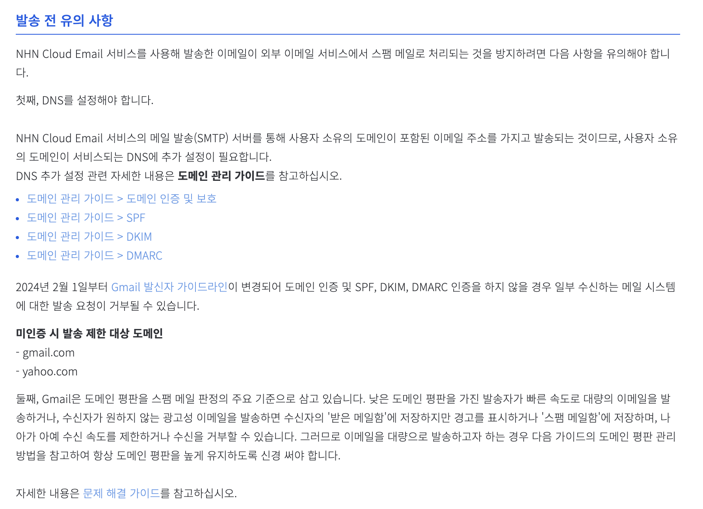
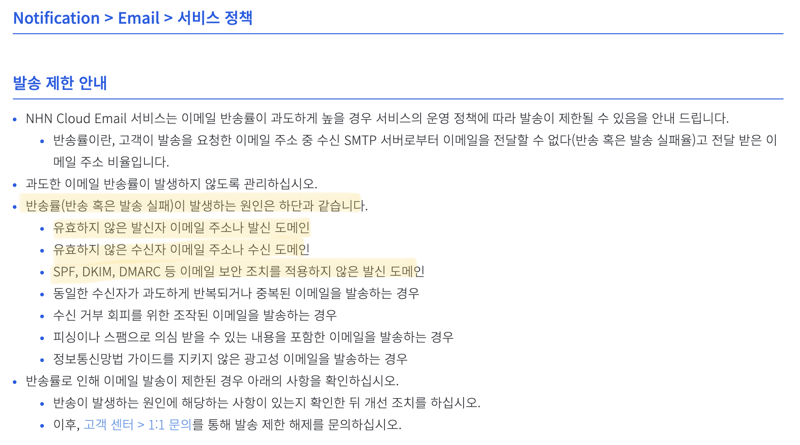
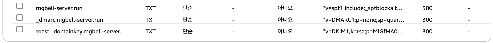
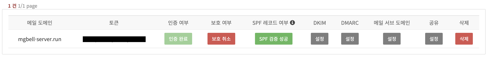
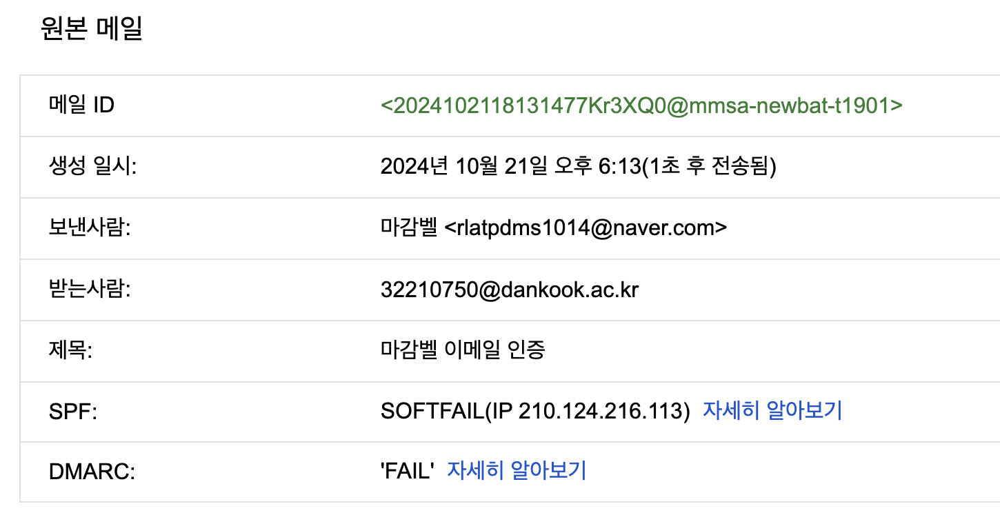
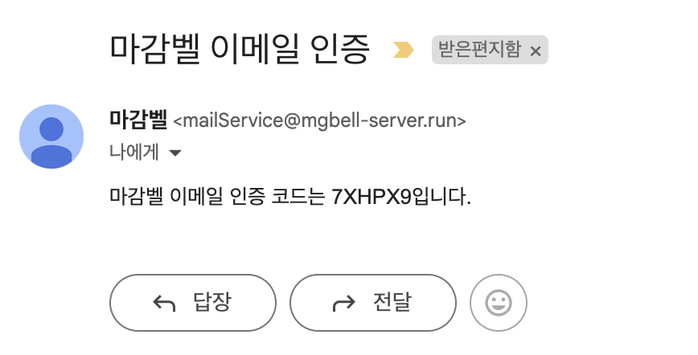

> Java / Spring 3.0 이상 버전 사용<br>


[사건의 발단] <br>
분명 2024년 6월까지만 해도 스팸처리 되긴 했지만 잘 가던 인증 메일이 9월.. 갑자기 보내지지 않기 시작했습니다...(naver, gmail에 수신되지 않음)

나름대로의 가설을 세워봤는데,<br>
1. NHN Cloud의 API 사용 미숙으로 인한 코드 상 오류
2. Naver와 Gmail의 보안 정책 변경으로 인한 미인증 도메인의 메일 발신 차단

6월까지만 해도 잘 되던 메일 서비스였기에, 2번일거라고는 상상도 못한 채 코드 상 오류를 찾아보려 거의 3일을 매달려 있었던 것 같습니다.

## 오류의 근원을 찾는 과정(aka. 삽질)
6월에는 동작했던 다른 작업물에서도 메일 발신이 안 되는 것을 보고 그제야 코드의 문제가 아니라는 것을 깨달았습니다.(...) <br>
구글링 대신 NHN Cloud API 사용 설명서 문서를 살펴보면 답이 있지 않을까 해서 하나하나 뜯어보고 있었는데




뭔가 망치로 머리를 얻어 맞은 것 같은 기분이 들었습니다.<br>


......<br><br>
새로운 가설<br>
1. 발신 이메일이 잘못됐다
2. 수신 이메일이 잘못됐다
3. 이메일 보안 조치를 적용하지 않았다

학교 이메일(dankook.ac.kr)로 메일을 보냈을 때는 분명 수신이 되었기 때문에 2번은 일단 제외시켰습니다.<br>
문제를 다 해결하고 보니, 1번과 3번 모두 문제였는데 이 때는 이메일 보안 조치를 적용했던 기억이 없었기 때문에 발신 이메일이 잘못되었을 것이라고는 상상치도 못했습니다.(..ㅜ)

## 이메일 보안 조치 적용
NHN Cloud API 문서를 살펴 보면, '도메인 관리 가이드' 탭을 찾을 수 있는데 [이 곳](https://docs.nhncloud.com/ko/Notification/Email/ko/smtp-guide/)에서 SMP, DKIM, DMARC 인증을 적용하는 방법을 친절하게 설명하고 있습니다. (저는 가비아에서 도메인을 구매했지만, 도메인 인증은 AWS Route53을 통해 진행했습니다.)

### Route53 설정


### NHN Cloud Email API Console 설정


가이드에 따라 SMP, DKIM, DMARC 인증을 적용한 후에 메일을 다시 보내봤습니다.

학교 메일로는 계속 수신이 되었기 때문에 수신된 메일의 원본을 봤는데 SPF와 DMARC 모두 'FAIL'인 것을 확인했습니다.

그래서 일단 AWS Route53에 레코드 값이 알맞게 들어간 게 맞는지 한 번 더 확인을 해봤지만, 이로 인한 오류는 아니었습니다.

> 여기서 포인트. 보낸사람의 메일 주소가 제 개인 주소로 설정되어 있습니다..^^....

인증을 적용할 때 눈치를 챘어야 했는데, 도메인 인증을 적용할 때 분명 마감벨의 도메인을 등록했는데...개인 이메일을 발신 이메일 주소로 지정해놔서.........인증된 도메인이 아니라.....메일 발신이 제대로 되지 않는 것이었습니다..!! ([힌트를 얻은 글](https://www.cloudflare.com/ko-kr/learning/dns/dns-records/dns-dmarc-record/))

## 삽질 끝.
### application.yml
```yaml
nhn:
  email: ${email}
  url: ${naver.api}
  secretKey: ${naver.secretKey}
```
### application.propperties
```yaml
email=임의-주소@인증했던-도메인.com
```
기존 application.propperties에서는 email 값에 인증 받지 않은 개인 이메일 주소(...)를 저장해두었는데, 인증 받은 도메인으로 재설정해주었습니다.<br>
임의 주소: 저는 mailService로 설정했습니다.<br>
인증했던 도메인: 위에 NHN Cloud Email Console에 인증 받아둔 mgbell-server로 설정했습니다.


## 짜잔

성공했습니다.....! 드디어.....<br>
중요표시까지..되어서..오는 모습...🥵

즐거운 코딩 생활..되세요..✨